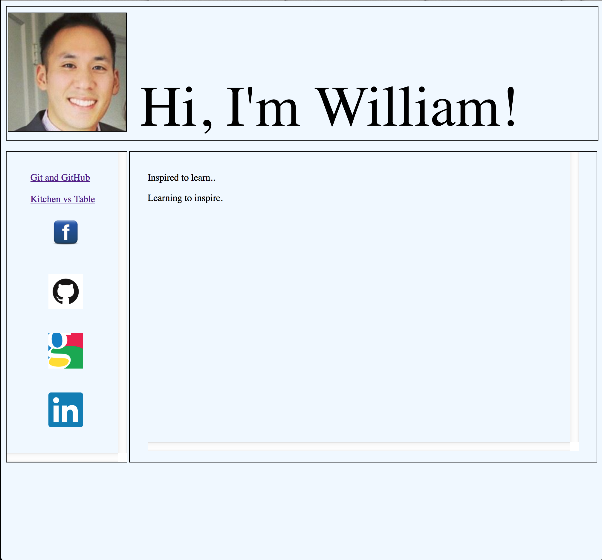

William K Tsang
==================

Welcome to my personal website. The idea of this website started when I enrolled at Dev Bootcamp, a 19 week intensive web developer program, to become a full stack web developer. 

Since the inception, I have rehauled the website 3 times, incorporating new technologies and inspirations that I have learned and acquired throughout my short journey as an web developer. 

Version 1 - Oct 2014
------------------------
A more frame design structure.

Version 2 - Dec 2014
------------------------
A more modern design structure.

Version 3 - March 2015
------------------------
My latest rehaul while using responsive design with a single page application in mind. 

I have decided not to use Bootstrap on my website just yet. I have previous experience with Bootsrap and it is a matter of Plug and Play. I want to know what it feels like to really build a website without using something that is already designed to look pretty.

Version 4 - (current)
------------------------

I decided to try out Bootstrap and I actually really like it! I customized it exactly to my liking. 

Enjoy as I add more content!

Content to be added
------------------------
- More projects